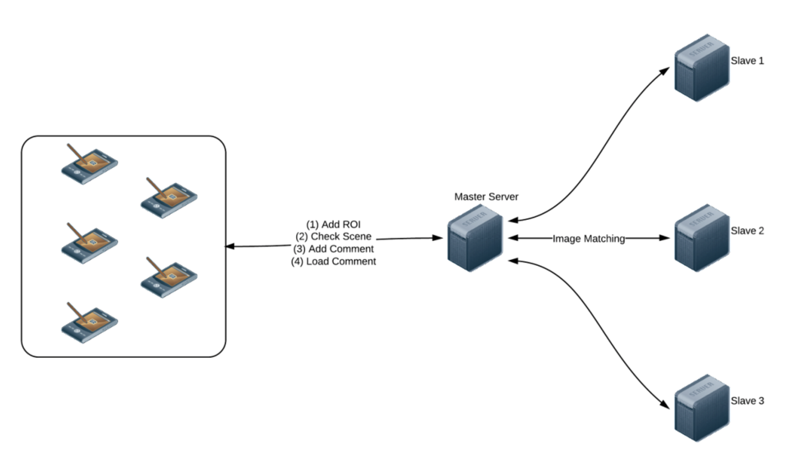
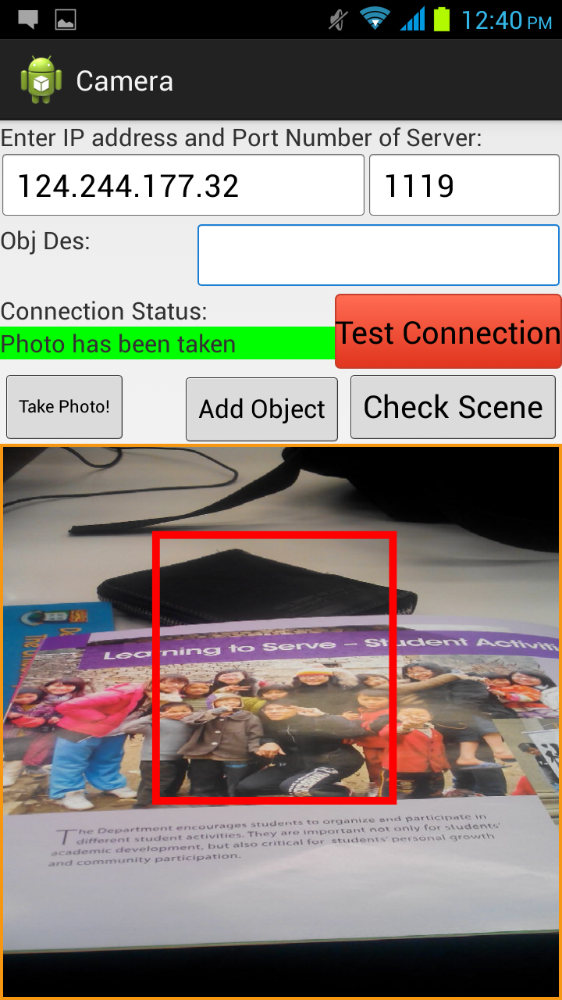
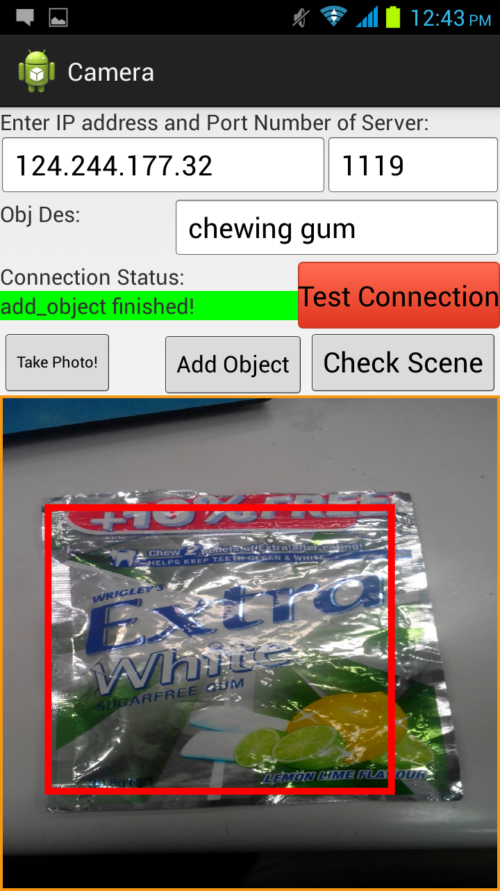
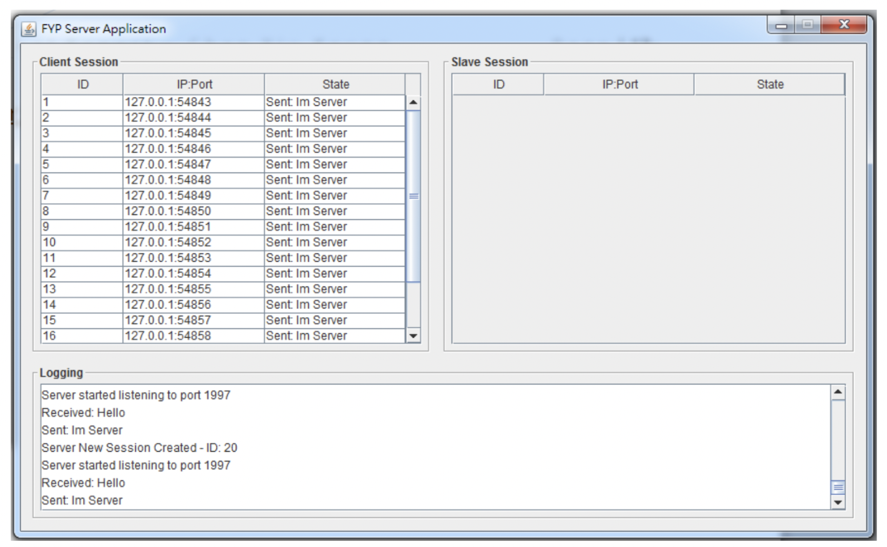

# Final Year Project: Augmented Reality (AR) on Mobile Devices
Develop an online cloud service using master-slaves architecture for massive images matching within a reasonable time.

A demo app is implemented to make use of the service to allow user “comment on everywhere”. Through this app, users can put/view comment on different images, eg: banners , street view, or even news pictures etc.

**Tech Stack**: C++, Java, OpenCV, MySQL, Master-Slaves Architecture, TCP/IP

---

## Architecture

---

## Mobile Client App
Screenshot 1             |  Screenshot 2
:-------------------------:|:-------------------------:
  |  

---

## Server App (Java)
Screenshot 1             |  Screenshot 2
:-------------------------:|:-------------------------:
  |  