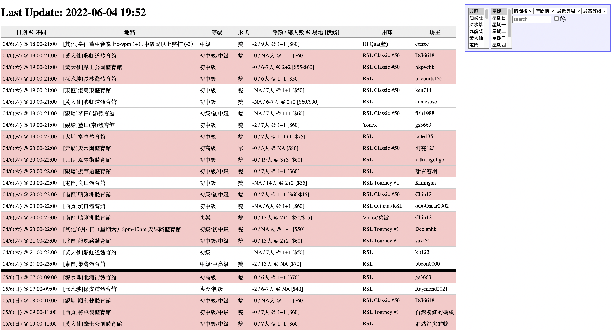

# Hobby: Badminton Events Portal
A popular [web service](https://www.haudosi.com) for people to find and join badminton events posted on a popular HK forum. AWS lambda is used to regularly monitor events on the forum, and parse the unstructured badminton events into structured database records for fast query.  

**Tech Stack**: AWS Lambda, Java, MySQL, PHP

---

