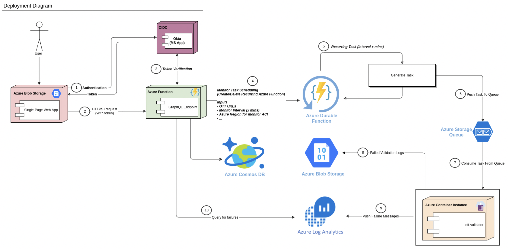
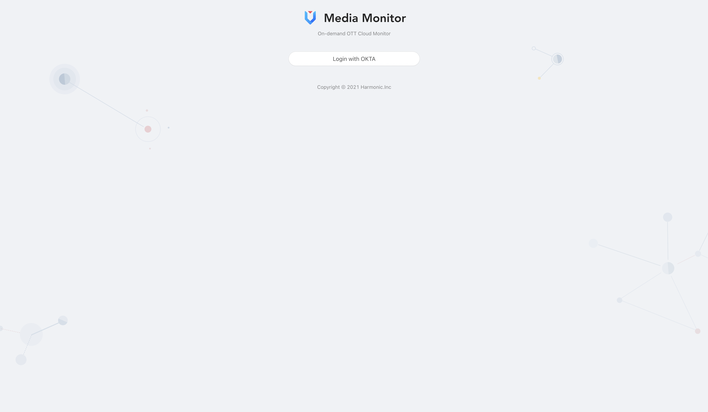
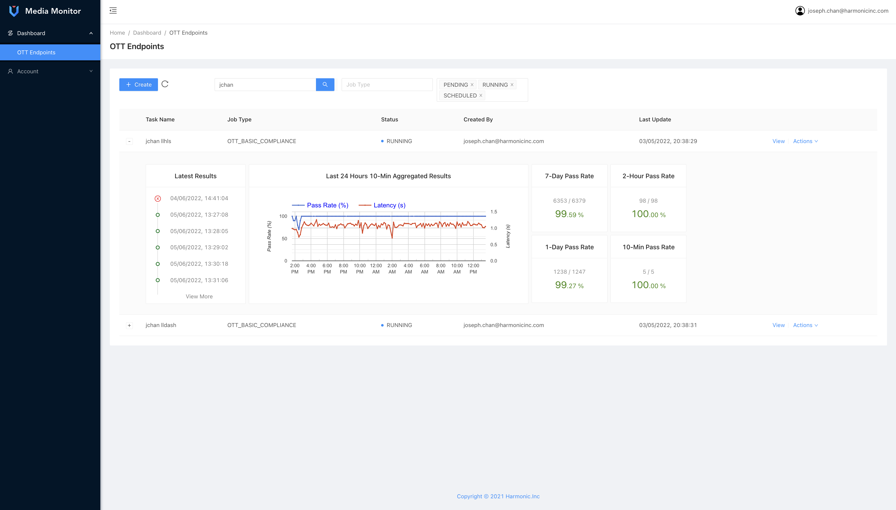
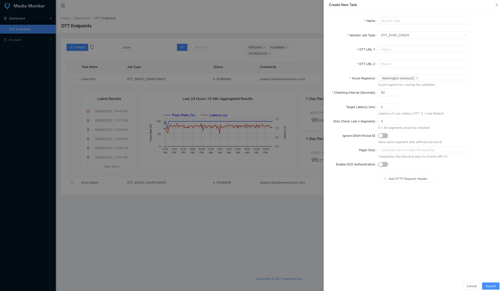
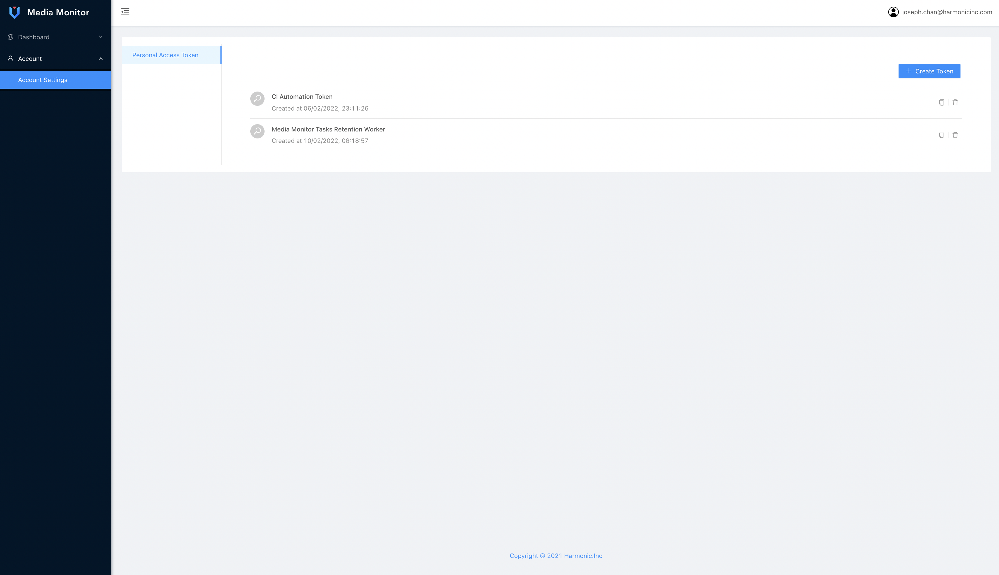

# Cloud based Media(OTT) Endpoints Monitor
An on-demand 24x7 cloud service for media monitoring. It is an auto-scaling service based on loading, scale-to-zero is supported to achieve low maintainance cost. Incidents are reported to SRE through pager duty when compliance check (eg: availability, synchronization, or latency etc.) failed.   

**Tech Stack**: VueJS, NodeJS (Typescript), Golang, Okta, GraphQL, Azure Cloud Services (eg: Cosmos DB, Function, Log Analytics and Container Instance etc.), PagerDuty, Distributed System, Auto Scaling, OTT, Security

---

## Architecture Overview

---

## Frontend Screenshots

